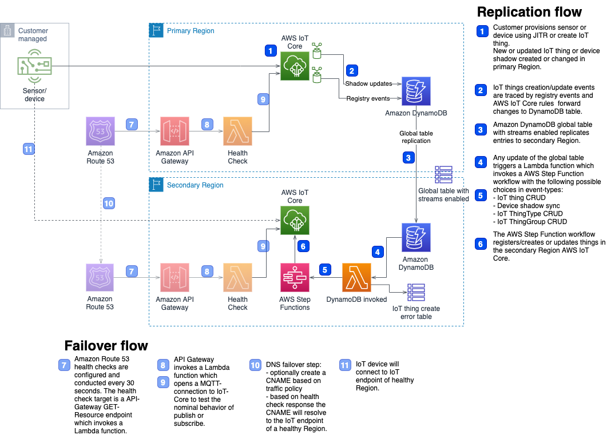

# Deprecation Notice

This AWS Solution has been archived and is no longer maintained by AWS. To discover other solutions, please visit the [AWS Solutions Library](https://aws.amazon.com/solutions/).

# Disaster Recovery for AWS IoT

This Disaster Recovery for AWS IoT Solution provides a setup to replicate device settings and device shadows from a primary AWS region to a secondary AWS region.

## Architecture



[AWS IoT registry events](https://docs.aws.amazon.com/iot/latest/developerguide/registry-events.html) are used to capture events when a device is being created updated or deleted. Event messages are stored in a [global DynamoDB table](https://docs.aws.amazon.com/amazondynamodb/latest/developerguide/GlobalTables.html) and replicated to the secondary region.

[DynamoDB Streams](https://docs.aws.amazon.com/amazondynamodb/latest/developerguide/Streams.html) are enabled in the secondary region to capture changes in the DynamoDB table. A Lambda function is triggered upon data arrival and executes an AWS Step Functions workflow. The step function workflow creates entries in the device registry in the secondary region. Then it retrieves the IoT policy and certificate attached to a device from the primary region. If the policy does not exist it is created in the secondary region. The device certificate is copied from the primary region and registered with the [multi-account registration](https://docs.aws.amazon.com/iot/latest/developerguide/x509-client-certs.html#multiple-account-cert) feature in the secondary region.

To create device certificates in the primary region you can use certificates issued by AWS IoT Core or bring your own CA.

You can find an in depth deployment guide for the solution at [link to AWS solution page here](link to AWS solution page here).

## Launch the solution
The build process described in this README is based on using an [AWS CloudShell](https://aws.amazon.com/cloudshell/) environment to prepare the launch of CloudFormation stacks which deploy the solution.

Artifacts to launch the solution will be prepared and copied to S3 buckets in the primary AWS region and the secondary AWS region. 

### Prepare AWS CloudShell
Upgrade pip to the latest version. 

```bash
pip3 install --upgrade pip --user
alias pip3=$HOME/.local/bin/pip3
```

### Configure
To deploy the artifacts you need to create three S3 buckets:

* `${BUCKET_NAME_PREFIX}-reference`: stores CloudFormation templates for the solution.
* `${BUCKET_NAME_PREFIX}-${PRIMARY_REGION}` and `${BUCKET_NAME_PREFIX}-${SECONDARY_REGION}`: used to store installation packages in the primary and secondary region.

In this example a date-time string is used to make the bucket names uniq. But you can change the `BUCKET_NAME_PREFIX` to another name.

```bash
export AWS_REGION=us-east-1
export PRIMARY_REGION=us-east-1
export SECONDARY_REGION=us-west-2
export SOLUTION_TRADEMARKEDNAME=disaster-recovery-for-aws-iot
export BUCKET_NAME_PREFIX="disaster-recovery-for-iot-$(date '+%Y%m%d%H%M%S')"
export VERSION=v1.0.0
```

### Create S3 buckets
Buckets to store CloudFormation templates and installation packages.

```bash
aws s3 mb  s3://${BUCKET_NAME_PREFIX}-reference --region=${AWS_REGION}
aws s3 mb  s3://${BUCKET_NAME_PREFIX}-${PRIMARY_REGION} --region=${PRIMARY_REGION}
aws s3 mb  s3://${BUCKET_NAME_PREFIX}-${SECONDARY_REGION} --region=${SECONDARY_REGION}
```

### Clone the repository
Use the following command to clone the repository.

```bash
git clone <repo url here>
```

### Prepare artifacts
The repository contains the script `build-s3-dist.sh` which is used to prepare the solution deployment.

#### Make the build script executable

```bash
cd <repo name here>/deployment
chmod +x build-s3-dist.sh
```

#### Build

```bash
./build-s3-dist.sh ${BUCKET_NAME_PREFIX} \
${SOLUTION_TRADEMARKEDNAME} \
${VERSION}
```

If you see an error message like the following from pip during the build process you can ignore it.

```
ERROR: pip's dependency resolver does not currently take into account all the packages that are installed. This behaviour is the source of the following dependency conflicts.
boto3 1.14.63 requires botocore<1.18.0,>=1.17.63, but you have botocore 1.19.48 which is incompatible.
```

### Copy artifacts to S3
Copy the artifacts to deploy the solution to S3 buckets in the primary and secondary AWS region.

```bash
aws s3 sync global-s3-assets/ s3://${BUCKET_NAME_PREFIX}-reference/${SOLUTION_TRADEMARKEDNAME}/${VERSION}/
aws s3 sync regional-s3-assets/ s3://${BUCKET_NAME_PREFIX}-${PRIMARY_REGION}/${SOLUTION_TRADEMARKEDNAME}/${VERSION}/
aws s3 sync regional-s3-assets/ s3://${BUCKET_NAME_PREFIX}-${SECONDARY_REGION}/${SOLUTION_TRADEMARKEDNAME}/${VERSION}/
```

Verify files have been copied		

```bash
# TEMPLATES
aws s3 ls s3://${BUCKET_NAME_PREFIX}-reference/${SOLUTION_TRADEMARKEDNAME}/${VERSION}/
# PRIMARY_REGION
aws s3 ls s3://${BUCKET_NAME_PREFIX}-${PRIMARY_REGION}/${SOLUTION_TRADEMARKEDNAME}/${VERSION}/
# SECONDARY_REGION
aws s3 ls s3://${BUCKET_NAME_PREFIX}-${SECONDARY_REGION}/${SOLUTION_TRADEMARKEDNAME}/${VERSION}/
```

### Registry events and fleet indexing 

**[Registry events](https://docs.aws.amazon.com/iot/latest/developerguide/registry-events.html) and [fleet indexing](https://docs.aws.amazon.com/iot/latest/developerguide/iot-indexing.html) for AWS IoT must be enabled in the primary region otherwise launching the stack will fail!**

#### Registry events
You can find your registry event configuration with the following command:

```bash
aws iot describe-event-configurations --region $PRIMARY_REGION
```

Event configurations must be set to `true`. If your configuration looks like the following then event configurations are disabled:

```
{
    "eventConfigurations": {
        "CA_CERTIFICATE": {
            "Enabled": false
        },
        "CERTIFICATE": {
            "Enabled": false
        },
        "JOB": {
            "Enabled": false
        },
        "JOB_EXECUTION": {
            "Enabled": false
        },
        "POLICY": {
            "Enabled": false
        },
        "THING": {
            "Enabled": false
        },
        "THING_GROUP": {
            "Enabled": false
        },
        "THING_GROUP_HIERARCHY": {
            "Enabled": false
        },
        "THING_GROUP_MEMBERSHIP": {
            "Enabled": false
        },
        "THING_TYPE": {
            "Enabled": false
        },
        "THING_TYPE_ASSOCIATION": {
            "Enabled": false
        }
    }
}
```

You can enable registry events with the following command:

```bash
aws iot update-event-configurations \
--region $PRIMARY_REGION \
--cli-input-json \
'{
    "eventConfigurations": {
        "THING_TYPE": {
            "Enabled": true
        },
        "JOB_EXECUTION": {
            "Enabled": true
        },
        "THING_GROUP_HIERARCHY": {
            "Enabled": true
        },
        "CERTIFICATE": {
            "Enabled": true
        },
        "THING_TYPE_ASSOCIATION": {
            "Enabled": true
        },
        "THING_GROUP_MEMBERSHIP": {
            "Enabled": true
        },
        "CA_CERTIFICATE": {
            "Enabled": true
        },
        "THING": {
            "Enabled": true
        },
        "JOB": {
            "Enabled": true
        },
        "POLICY": {
            "Enabled": true
        },
        "THING_GROUP": {
            "Enabled": true
        }
    }
}'
```

#### Fleet indexing
Use the following command to verify if fleet indexing is enabled for the REGISTRY:

```bash
aws iot describe-index --index-name "AWS_Things" --region $PRIMARY_REGION
```

When you get an error like the following fleet indexing is not enabled: 

```bash
An error occurred (ResourceNotFoundException) when calling the DescribeIndex operation: Index AWS_Things does not exist
```

Use the following command to enable fleet indexing:

```bash
aws iot update-indexing-configuration \
--thing-indexing-configuration thingIndexingMode=REGISTRY \
--region $PRIMARY_REGION
```

### Quickstart link
Use a quickstart link to launch the CloudFormation stacks for the solution. The following command will output the quickstart link for your environment.


```bash
echo "https://console.aws.amazon.com/cloudformation/home?region=${AWS_REGION}#/stacks/quickcreate?templateUrl=https://s3.amazonaws.com/${BUCKET_NAME_PREFIX}-reference/${SOLUTION_TRADEMARKEDNAME}/${VERSION}/disaster-recovery-for-aws-iot.template&stackName=IoTDRSolution"
```

Open the quickstart link in your Browser and follow the steps below to launch the solution.

* By default the stack name is IoTDRSolution. Consider to use a more meaningful name like `IoTDRSolution-primary-region-secondary-region`. This helps to distinguish DR setups if you launch multiple stacks.
* Primary AWS region: `us-east-1`
* Secondary AWS region: `us-west-2`
* Check `I acknowledge that AWS CloudFormation might create IAM resources.`
* Create stack

* This template launches a so called main stack. It launches a CodeBuild project which creates additional stacks in the primary and secondary region.
* The main stack should be finished within round about 2 mins.
* After the main stack has been created you can watch the progress of creating the other stacks at your CodeBuild project
* In the outputs section of your main stack click the link next to `CodeBuildLaunchSolutionProject`
* Under `Build history` -> `Build run` you will find a link with a name similar to `CodeBuildLaunchSolution-[A_UNIQUE_STRING]`
* Click the link
* Click `Tail logs`
* A window is opened where you can see the progress of the IoT DR solution setup
* Several CloudFormation stacks are launched
* Every stack is postfixed with a timestamp in the format `%Y%m%d%H%M%S`
* Stacks in primary region:
	* `IoTDRPrimary[POSTFIX]`
	* `R53HealthChecker[POSTFIX]`
* Stacks in secondary region:
	* `IoTDRSecondary[POSTFIX]`
	* `R53HealthChecker[POSTFIX]`
* The CodeBuild project should take round about 10mins. to finish

In the outputs section of your main stack you will also find links to the CloudFormation stacks in the primary and secondary region


## Testing

### All at once
To test the solution with multiple devices you can use the script `iot-dr-run-tests.sh`.

**Note**: You must have enabled registry indexing in the primary and secondary region to use the script.

Several environment variables for the IoT DR solution must be set for the script to run.

To run the script:

* If you use the script in an AWS CloudShell environment install the openssl and uuid packages and the awsiotsdk and dnspython python libraries
	* `sudo yum -y install openssl uuid` 
	* `pip3 install -r requirements.txt --user`
* Change to the directory where the tools are located
	* `cd <repo name here>/source/tools` 
* Copy the toolsrc file (location can be found in the outputs section of the main CFN stack) to your work environment
	* `aws s3 cp REPLACE_WITH_TOOLSURL_FROM_THE_OUTPUT_OF_YOUR_STACK/toolsrc .`
* `chmod +x *.sh *.py`
* Copy device replication library
	* `cp ../lambda/iot-dr-layer/device_replication.py .`
* `. toolsrc # source toolsrc`
* `./iot-dr-run-tests.sh -n <number_of_devices_to_create>`
* The script performs the following actions:
 * Bulk provision number of devices given by the -n switch
 * Create and compare -n number of shadows, compare them in both regions and delete the shadows
 * Picks some device created by bulk provision randomly and pub/sub in both regions
 * Compare device settings thing_name/policy_name/cert_id in for the things created by bulk provisioning in both regions
 * Delete the devices created by bulk provisioning

